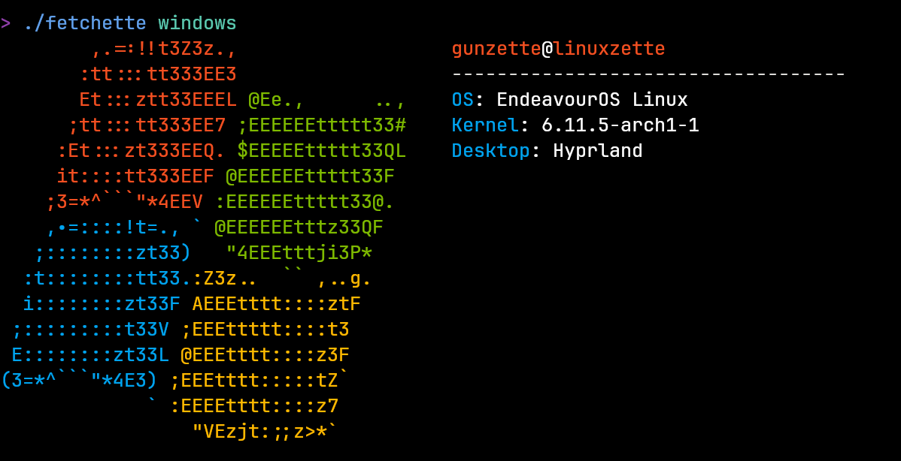

# Fetchette
This will (hopefully) be a neofetch-like program in go if it gets finished

## Current state of the program:

## Todos
- [X] Use terminal colors in go
- [X] Create go module to use display colors more easily
- [X] Display ASCII art
- [ ] Get system info: WIP
- [X] Display system info next to logo
### Todo further
- [ ] Add more, good ASCII art
- [ ] Use `flags` instead of `os.Args`
- [ ] Stop with the `log.Fatal`s and actually create good error handling: WIP (Done for termcolor, but not modules)
- [X] Make OS info output colored
- [ ] Fix the amount of underlines being wrong due to ansii
- [ ] add cpu module to windows

## WARNING
Will only work on windows if called from bash shell or similar, will fail in powershell 

## Additional Information
The arch and windows logo ascii art is taken from [fastfetch](https://github.com/fastfetch-cli/fastfetch) the LICENSE for them is in the ascii directory
