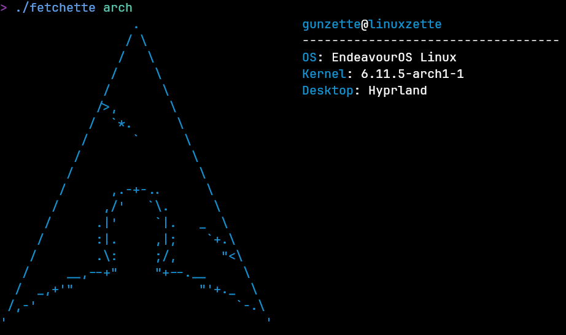

# Fetchette
This will (hopefully) be a neofetch-like program in go if it gets finished

## Current state of the program:

## Todos
- [X] Use terminal colors in go
- [X] Create go module to use display colors more easily
- [X] Display ASCII art
- [ ] Get system info: WIP
- [X] Display system info next to logo
### Todo further
- [ ] Add more, good ASCII art
- [ ] Use `flags` instead of `os.Args`
- [ ] Stop with the `log.Fatal`s and actually create good error handling
- [ ] Make OS info output colored
### Maybe Todo
- [ ] Get OS info on systems other than linux

## External Dependencies
- `lsb_release`
